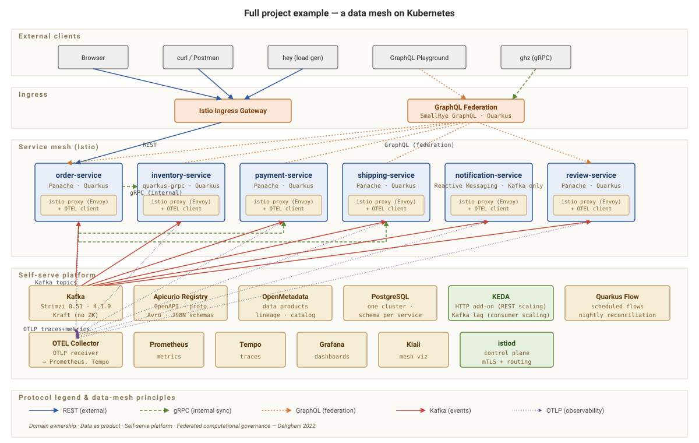

# Data Mesh Reference Architecture · Quarkus


A **runnable data-mesh reference architecture** on **Quarkus + Camel +
Kubernetes** — seven services modeling order-placement-through-shipment,
each owning its data, its API surface, and its operational lifecycle,
talking over a deliberate mix of REST, gRPC, GraphQL, and Kafka.

It serves two purposes at once:

1. **A data mesh.** It rebuilds the sibling
   [`datamesh-reference-arch-python`](https://github.com/patterncatalyst/datamesh-reference-arch-python)
   reference — Zhamak Dehghani's four principles (domain ownership, data
   as a product, self-serve platform, federated computational governance)
   — as a running system, with contracts, a catalog, progressive delivery,
   event-driven autoscaling, and full observability.
2. **A Quarkus showroom.** The same services exercise Panache, gRPC,
   GraphQL, Reactive Messaging, Camel-on-Quarkus, langchain4j/MCP,
   WebSockets.Next, OIDC, and Vert.x reactive execution — with a
   runnable Spring Boot twin service (`examples/spring-boot-compare`) for
   a real side-by-side JVM comparison.

## Architecture at a glance

**Seven services:** `order`, `inventory`, `payment`, `shipping`,
`notification`, `review`, plus a `graphql-gateway` that federates them
into one composed query surface.

**Three coordination engines over the same domain** (see
[`_docs/13-orchestration-styles.md`](_docs/13-orchestration-styles.md)):

| Engine | Style | Where |
|---|---|---|
| Kafka choreography | decentralized — no named coordinator | `order-service` → `payment-service` → `shipping-service` → `notification-service` |
| Camel orchestration | a route explicitly sequences the steps | `ai-rules-service` (`POST /api/orders/triage`) |
| Quarkus Flow orchestration | a declarative workflow document | `ai-rules-service` (`POST /api/orders/triage-flow`) |

**Substrate:** a local Docker Compose stack (Postgres, Kafka, Apicurio,
the Grafana LGTM observability stack) for day-to-day dev, plus a local Kubernetes
cluster with Istio, KEDA, Strimzi (Kafka operator), and CloudNativePG
(Postgres operator) for the Kubernetes-native demos — see `k8s/` and
`scripts/bootstrap.sh`.



## Quickstart

```bash
cp .env.example .env
docker compose up -d          # Postgres, Kafka, Apicurio, LGTM observability
./demos/demo-order.sh         # or: ./demos/walkthrough.sh for the full tour
```

See [`demos/README.md`](demos/README.md) for the full demo-by-demo matrix
(19 `demo-*.sh` scripts, grouped by infra tier and opt-in profile), and the
site's [demos & examples](https://patterncatalyst.github.io/datamesh-reference-arch-quarkus/demos/)
page for the same content by data-mesh principle.

## Build & test

```bash
mvn verify -f examples/pom.xml   # unit + integration tests, every service
./scripts/run-all-tests.sh       # single entrypoint for the full test suite
mvn package -Pnative             # native build (GraalVM/Mandrel), per service
```

## The tutorial + decks

The full narrative — twenty-one chapters across six parts — lives in
[`_docs/`](_docs/) as a Jekyll site (start at
[`_docs/00-index.md`](_docs/00-index.md) or the published site's homepage).
It covers the data-mesh concepts, the services and their contracts,
progressive delivery and observability, the anti-patterns, and a dedicated
Quarkus deep-dive (capability tour, Spring Boot comparison, orchestration
styles).

Two companion decks for the "Building a Datamesh using Quarkus and
Kubernetes" talk live in [`presentation/`](presentation/):

- **101** (`presentation/datamesh-101/`) — concept-forward overview, ~17 slides.
- **201** (`presentation/datamesh-201/`) — deep-dive with live demos and a
  large appendix, ~81 slides.

## Repo map

```
examples/        — runnable services (order, inventory, payment, shipping,
                    notification, review, graphql-gateway, ai-mcp-service,
                    ai-rules-service, domain-model, contracts) built via
                    mvn verify -f examples/pom.xml, plus the standalone
                    spring-boot-compare twin service
demos/           — 19 demo-*.sh scripts + walkthrough.sh, one per capability
tooling/         — Newman/Postman API collection + hey/ghz load scripts
k8s/             — kustomize manifests for the local Kubernetes cluster
scripts/         — bootstrap/setup/teardown scripts for the local stack
assets/diagrams/ — paired SVG + Excalidraw architecture diagrams
presentation/    — the 101 and 201 decks (pptxgenjs)
_docs/           — the tutorial chapters (Jekyll docs collection)
```

## License

Apache License 2.0 — see [`LICENSE`](LICENSE).
